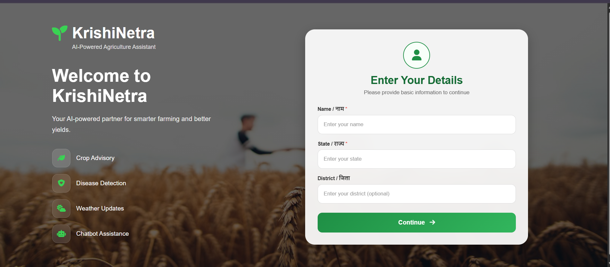
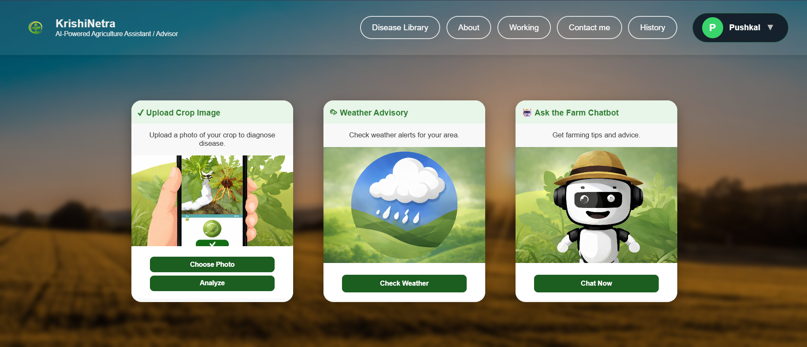
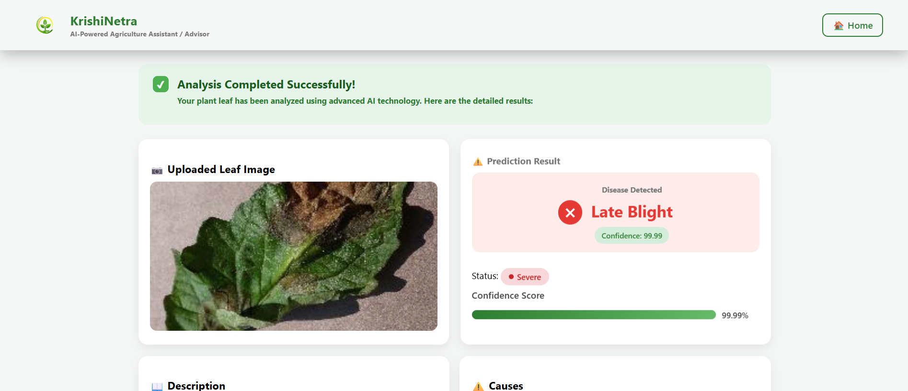
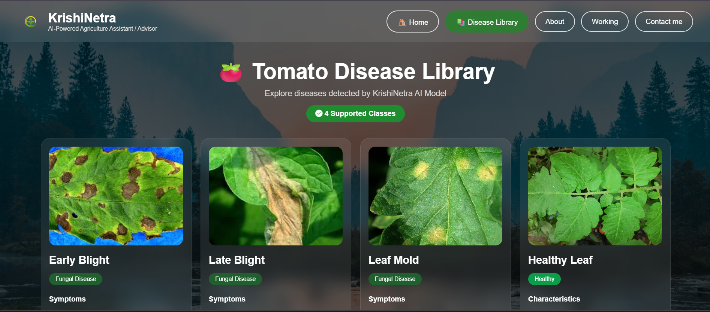
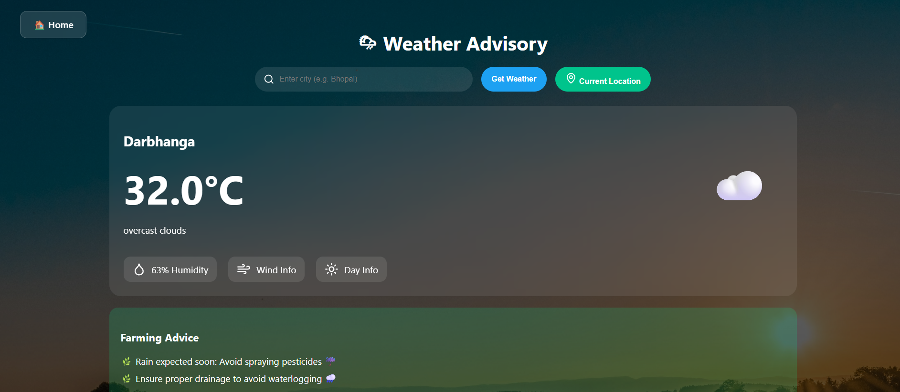
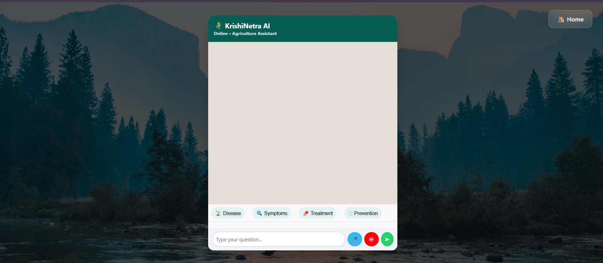
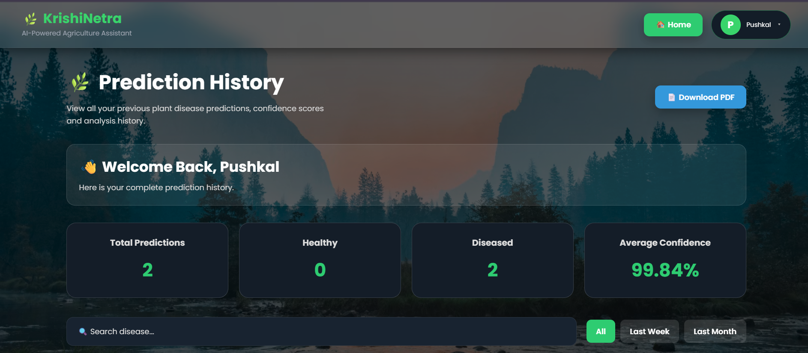
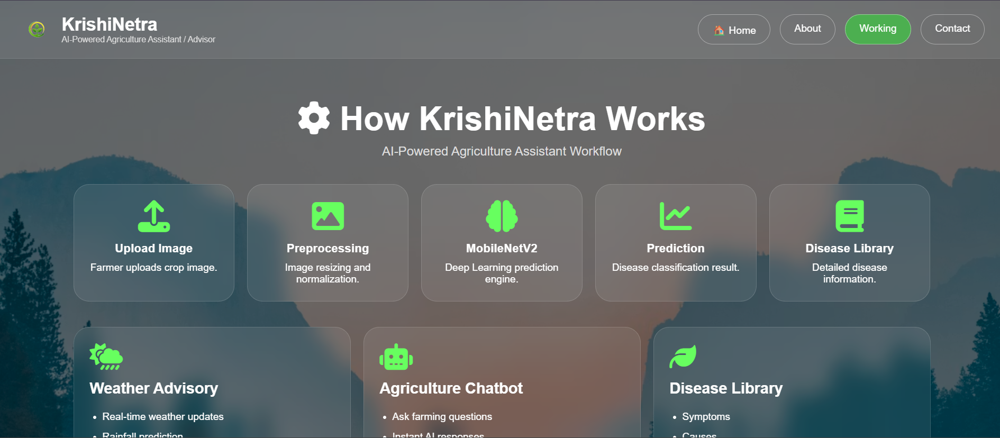
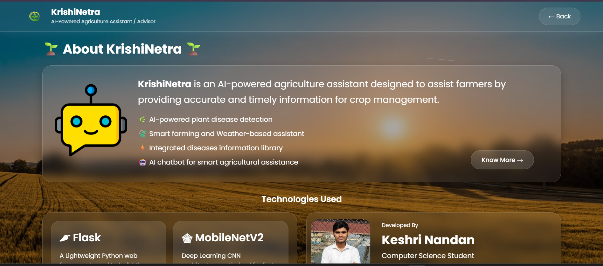

# 🌱 KrishiNetra – AI-Powered Agriculture Assistant

KrishiNetra is an AI-powered agriculture assistant designed to help farmers detect **tomato plant diseases** using deep learning. The application also provides **weather-based farming advice**, an **AI chatbot**, and **prediction history** through a user-friendly web interface.

---

## 🚀 Features

### 🌿 AI Plant Disease Detection

- Upload a tomato leaf image.
- Detects the following classes:
  - Healthy
  - Early Blight
  - Late Blight
  - Leaf Mold
  - Yellow Leaf Curl Virus
- Displays prediction confidence.
- Shows disease information, treatment, and prevention advice.
- Provides Top predictions based on confidence.

### 🌦️ Weather Advisory

- Search weather by city.
- Supports current location using GPS.
- Displays temperature, humidity, weather conditions, and forecast.
- Provides farming advice based on weather conditions.

### 🤖 AI Chatbot

- Helps users with agriculture-related questions.
- Provides disease-related information.
- Supports contextual questions based on the latest prediction.
- Integrated with an AI API.

### 📊 Prediction History

- Stores previous disease predictions.
- Displays prediction statistics.
- Search predictions by disease.
- Filter records by:
  - All
  - Last Week
  - Last Month
- Print or download prediction history.

### 📚 Disease Library

Provides information about tomato plant diseases, including symptoms, treatment, and prevention.

### 📱 Responsive Design

The application is designed to work on desktop and mobile devices.

---
## 📸 Project Screenshots

### 🏠 Welcome Page



### 🏡 Home Dashboard



### 🔍 Disease Prediction



### 🌿 Disease Library



### 🌦️ Weather Advisory



### 🤖 AI Chatbot



### 📊 Prediction History



### ℹ️ How It Works



### 👨‍💻 About Project



---

## 🧠 AI Model

The disease detection model is built using **MobileNetV2 Transfer Learning**.

### Model Details

- **Model:** MobileNetV2
- **Framework:** TensorFlow / Keras
- **Input Image Size:** 224 × 224
- **Dataset:** PlantVillage Tomato Dataset
- **Classes:** 5

The model detects:

| Class                  | Description                   |
| ---------------------- | ----------------------------- |
| Healthy                | Healthy tomato leaf           |
| Early Blight           | Tomato Early Blight           |
| Late Blight            | Tomato Late Blight            |
| Leaf Mold              | Tomato Leaf Mold              |
| Yellow Leaf Curl Virus | Tomato Yellow Leaf Curl Virus |

---

## 🛠️ Technologies Used

### Backend

- Python
- Flask
- TensorFlow
- Keras

### Frontend

- HTML
- CSS
- JavaScript
- Jinja Templates

### Database

- MySQL

### APIs & Services

- OpenAI API
- OpenWeatherMap API
- Flask-Mail

### Deployment

- Gunicorn

---

## 📁 Project Structure

```text
KrishiNetra/
│
├── static/
│   ├── css/
│   └── images/
│
├── templates/
│   ├── about.html
│   ├── chatbot.html
│   ├── contact.html
│   ├── disease_library.html
│   ├── history.html
│   ├── index.html
│   ├── result.html
│   ├── weather.html
│   └── welcome.html
│
├── uploads/
├── dataset/
│
├── app.py
├── model.h5
├── train.py
├── requirements.txt
├── .env.example
├── .gitignore
└── README.md
```
